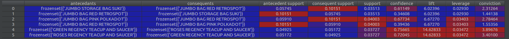

# Exploration of Recommender Systems

**Recommender Systems**

Recommender systems are useful for recommending users items based on their past preferences. Broadly, 
recommender systems can be split into content-based and collaborative-filtering types. 
Such recommender systems are predictive in nature. For example, we predict what the user might want to buy next.
Here, we use the Surprise python package. http://surpriselib.com/

Example: Amazon - "You May Also Like"

**Association Mining**

Also, we will delve a bit into association mining, which is a form of descriptive analytics. 
This can be used to develop marketing strategies like cross-selling or up-selling.
Here, we use the mlxtend python package. https://github.com/rasbt/mlxtend

Example: Amazon - "Frequently Bought Together"


## Content-based : Nearest Neighbours - Top Recommendations

**Nearest Neighbours of Item - nearest_neighbours.py**

This code demonstrates how to get the 10 most related items (nearest neighbours) to the movie item "Clockwork Orange". 

    
## User and Item Based Collaborative Filtering

**User and Item based collaborative filtering - collaborative_filtering_exploration.py**

Algorithms used: http://surprise.readthedocs.io/en/stable/knn_inspired.html

This code demonstrates how collaborative filtering for user-based and item-based methods can be done
in Python. 

Advantages of item-based filtering over user-based filtering : 

1) **Scales Better** : User-based filtering does not scale well as user likes/interests may change frequently. Hence, 
the recommendation needs to be re-trained frequently. 

2) **Computationally Cheaper** : In many cases, there are way more users than items. It makes sense to use item-based
filtering in this case. 

A famous example of item-based filtering is **Amazon's** recommendation engine. 

https://www.cs.umd.edu/~samir/498/Amazon-Recommendations.pdf

## Utilizing Grid Search

**Grid Search on KNNMeans Algorithm - grid_search.py**

An extensive grid search to find the best hyper-parameters for KNNMeans on this dataset. **Warning**: Takes a long time!

Results:
````
Grid Search Results: 

0.931737661568928
{'k': 40, 'bsl_options': {'n_epochs': 1, 'reg_i': 40, 'method': 'als', 'reg_u': 25}, 'sim_options': {'user_based': False, 'name': 'pearson_baseline'}}

Evaluating RMSE, MAE of algorithm KNNWithMeans on 5 split(s).
                  Fold 1  Fold 2  Fold 3  Fold 4  Fold 5  Mean    Std     
MAE (testset)     0.7161  0.7176  0.7171  0.7178  0.7227  0.7182  0.0023  
RMSE (testset)    0.9131  0.9185  0.9173  0.9171  0.9239  0.9180  0.0035  
Fit time          1.11    1.12    1.10    1.05    0.96    1.07    0.06    
Test time         2.06    2.06    2.05    2.05    2.05    2.05    0.00    
{'fit_time': (1.1072561740875244, 1.1171300411224365, 1.1014506816864014, 1.052947998046875, 0.9627974033355713), 'test_rmse': array([0.91305966, 0.91854328, 0.91732058, 0.9170613 , 0.92394471]), 'test_mae': array([0.71609261, 0.71756385, 0.7170833 , 0.71775924, 0.72269525]), 'test_time': (2.0553717613220215, 2.055539846420288, 2.047955274581909, 2.052337884902954, 2.045203685760498)}

````

## Matrix Factorization Algorithms

**Singular Vector Decomposition (SVD, SVD++) - SVD.py**

These algorithms are famous for being the baseline algos for winning the Netlix Prize. 

http://buzzard.ups.edu/courses/2014spring/420projects/math420-UPS-spring-2014-gower-netflix-SVD.pdf

For SVD

````
Evaluating RMSE, MAE of algorithm KNNWithMeans on 5 split(s).

                  Fold 1  Fold 2  Fold 3  Fold 4  Fold 5  Mean    Std     
MAE (testset)     0.7191  0.7158  0.7138  0.7166  0.7254  0.7181  0.0040  
RMSE (testset)    0.9173  0.9162  0.9125  0.9179  0.9271  0.9182  0.0048  
Fit time          1.04    1.11    1.03    1.01    0.90    1.02    0.07    
Test time         2.08    2.06    2.06    2.05    2.06    2.06    0.01    
{'test_mae': array([0.71909501, 0.71579784, 0.71384567, 0.71656901, 0.72541331]), 'fit_time': (1.0419056415557861, 1.1055827140808105, 1.0349535942077637, 1.01346755027771, 0.9016950130462646), 'test_rmse': array([0.91726677, 0.91622589, 0.91245293, 0.91793969, 0.92711428]), 'test_time': (2.0783369541168213, 2.0616250038146973, 2.0627968311309814, 2.049354314804077, 2.058506727218628)}

SVD : Test Set
RMSE: 0.9000
````

For SVD++ (Before running : Be warned it is much slower than SVD)
````
Grid Search Results:

0.9167768433405562
{'n_factors': 40, 'reg_all': 0.1, 'n_epochs': 40, 'lr_all': 0.008}

Evaluating RMSE, MAE of algorithm SVDpp on 5 split(s).

                  Fold 1  Fold 2  Fold 3  Fold 4  Fold 5  Mean    Std     
RMSE (testset)    0.9104  0.9053  0.9111  0.9133  0.9124  0.9105  0.0028  
MAE (testset)     0.7188  0.7145  0.7204  0.7224  0.7203  0.7193  0.0027  
Fit time          336.05  334.75  335.30  334.70  339.24  336.01  1.69    
Test time         1.79    1.84    1.86    1.84    1.74    1.81    0.04    

SVD++ : Test Set
RMSE: 0.9141


````


A little slow? Can we use **GPU** to accelerate this? Yes! (for future explorations)

https://devblogs.nvidia.com/numba-python-cuda-acceleration/

http://www.nvidia.com/content/GTC/documents/1034_GTC09.pdf

https://github.com/NVIDIA/DeepRecommender

**C-Based Implementations**

libFM - Recommended by many
https://github.com/srendle/libfm

xLearn - supports out-of-core training, fast, has Python and R APIs
https://github.com/aksnzhy/xlearn

## Association Mining

**Association Mining : association_mining.py**

Demonstrates how to get frequent items and association rules using the mlxtend package. 



One finding is this:

Jumbo Storage Bag Suki is usually bought together with Jumbo Bag Red Retrospot. 

Association Mining from another repo : https://github.com/lppier/League_Of_Legends_Data_Analytics/blob/master/AssociationAnalysis.Rmd
